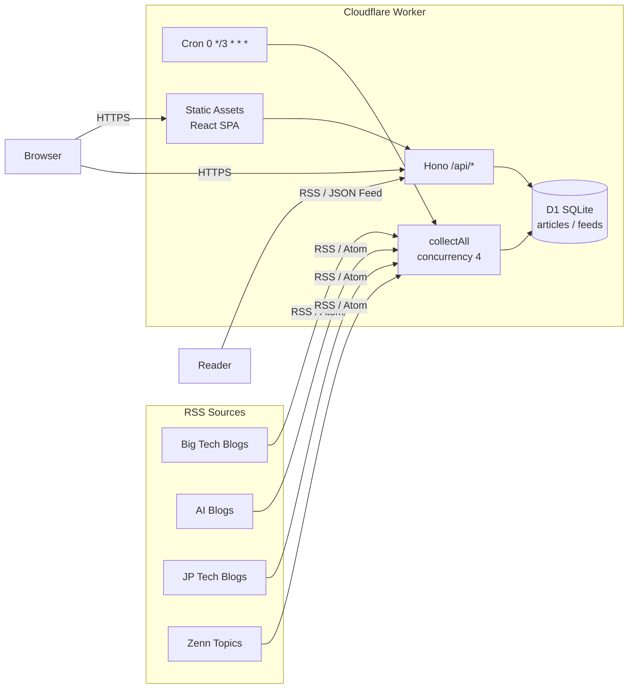

# tech-news-bot

海外 big tech / AI tech / 国内企業の tech blog を 3 時間ごとに RSS / Atom フィードから収集し、Cloudflare 無料枠のみで動作する Web UI と JSON Feed / RSS で配信する PoC アプリケーション。Worker 1 つで Cron 収集・API・SPA 配信をすべて担う。

コントリビューター向けの詳細は [CONTRIBUTING.md](CONTRIBUTING.md) を参照。AI エージェント (Claude Code) 向けのガイドは [CLAUDE.md](CLAUDE.md) を参照。

## アーキテクチャ



すべて Cloudflare 無料枠で動作します。

| レイヤ       | サービス                                                  |
| ------------ | --------------------------------------------------------- |
| RSS 収集     | Cloudflare Workers Cron Triggers (3 時間ごと)             |
| データベース | Cloudflare D1 (SQLite) + FTS5 全文検索                    |
| API          | 同 Worker 内で Hono が `/api/*` と `/feed.*` を処理       |
| 静的フロント | Worker Static Assets (Vite でビルドした React 18 SPA)     |
| 設定         | `apps/web/worker/feeds.yaml` を Worker に build 時 inline |

## SPA スクリーンショット

<!-- TODO: screenshot here -->

## クイックスタート

**必要なもの**

- Node.js 24 以上
- pnpm 10 以上
- Vite+ (`vp`): `curl -fsSL https://vite.plus | bash`
- Cloudflare アカウント + `wrangler login`

```bash
# 1. 依存インストール
pnpm install

# 2. ローカル D1 にマイグレーションを適用
pnpm migrate:local

# 3. 開発サーバー起動 (http://localhost:8787)
pnpm dev
```

ローカルで Cron を手動実行する場合:

```bash
curl "http://localhost:8787/__scheduled?cron=0+*/3+*+*+*"
```

## 主要コマンド

ツールチェインは [Vite+](https://viteplus.dev/) (`vp`) ベース。

| 目的                        | vp 直                              | pnpm script          |
| --------------------------- | ---------------------------------- | -------------------- |
| dev サーバー起動            | `vp dev` (`apps/web/` で実行)      | `pnpm dev`           |
| 本番ビルド                  | `vp run build`                     | `pnpm build`         |
| lint                        | `vp lint`                          | `pnpm lint`          |
| format                      | `vp fmt --write`                   | `pnpm format`        |
| typecheck                   | `pnpm -r typecheck`                | `pnpm typecheck`     |
| lint + fmt + typecheck      | `vp check`                         | `pnpm check`         |
| テスト                      | `vp test run` (`apps/web/` で実行) | `pnpm test`          |
| Cloudflare 型生成           | —                                  | `pnpm cf-typegen`    |
| D1 マイグレーション (local) | —                                  | `pnpm migrate:local` |
| D1 マイグレーション (prod)  | —                                  | `pnpm migrate:prod`  |
| デプロイ                    | —                                  | `pnpm deploy`        |

テスト実行前に `pnpm build` が必要です (`@cloudflare/vitest-pool-workers` が `dist/client` を要求するため)。

## API 使用例

本番 URL: `https://tech-news-bot.rikeda71.workers.dev`

```bash
# AI カテゴリの記事を 5 件取得
curl "https://tech-news-bot.rikeda71.workers.dev/api/articles?category=ai&limit=5"

# 日本語記事を全文検索
curl "https://tech-news-bot.rikeda71.workers.dev/api/articles?lang=ja&q=LLM"

# 収集統計を確認
curl "https://tech-news-bot.rikeda71.workers.dev/api/stats"

# RSS 2.0 フィード (日本語記事のみ)
curl "https://tech-news-bot.rikeda71.workers.dev/feed.xml?lang=ja"

# JSON Feed v1.1
curl "https://tech-news-bot.rikeda71.workers.dev/feed.json"

# TODO: OpenAPI スキーマ (#33 マージ後に追加)
# curl "https://tech-news-bot.rikeda71.workers.dev/api/openapi.json"
```

### API リファレンス

| Method | Path            | 説明                                                                    |
| ------ | --------------- | ----------------------------------------------------------------------- |
| GET    | `/api/articles` | 記事一覧。クエリ: `category`, `lang`, `feed_id`, `q`, `limit`, `cursor` |
| GET    | `/api/feeds`    | フィード一覧と最終収集状況                                              |
| GET    | `/api/stats`    | カテゴリ別・フィード別の記事数統計                                      |
| GET    | `/api/health`   | DB 接続疎通と総記事数                                                   |
| GET    | `/feed.json`    | JSON Feed v1.1 (直近 50 件、`category` / `lang` 絞り込み可)             |
| GET    | `/feed.xml`     | RSS 2.0 (同上)                                                          |

`/api/articles` のページングは Base64 エンコードされた cursor を `nextCursor` で返します。

## デプロイ手順

### 初回セットアップ

```bash
# 1. D1 データベースを作成
pnpm exec wrangler d1 create tech-news-bot-db
# 出力された database_id を apps/web/wrangler.toml の [[d1_databases]] に設定

# 2. 本番 D1 にマイグレーションを適用
pnpm migrate:prod

# 3. Admin Token を登録 (省略可)
pnpm exec wrangler secret put ADMIN_TOKEN

# 4. Collector アラート webhook を登録 (省略可)
#    Slack / Discord の incoming webhook URL を設定すると、
#    フィード取得失敗数が COLLECTOR_ALERT_THRESHOLD (default: 5) 以上のとき通知される
pnpm exec wrangler secret put COLLECTOR_ALERT_WEBHOOK
```

### GitHub Actions による自動デプロイ

`main` ブランチへの push で `.github/workflows/deploy.yml` が自動デプロイします。以下の Repository Secrets を設定してください:

| Secret 名               | 取得場所                                                    |
| ----------------------- | ----------------------------------------------------------- |
| `CLOUDFLARE_API_TOKEN`  | Cloudflare Dashboard > My Profile > API Tokens              |
| `CLOUDFLARE_ACCOUNT_ID` | Cloudflare Dashboard > アカウントのホームページ右サイドバー |

### 手動デプロイ

```bash
pnpm deploy
# 内部で vite build → wrangler deploy を実行
```

## ディレクトリ構成

```
tech-news-bot/                    pnpm workspace root
├── apps/web/                     デプロイ単位 (Cloudflare Worker + SPA)
│   ├── client/                   React 18 + Vite SPA
│   ├── worker/                   Hono API + cron collector
│   │   ├── api/                  /api/* エンドポイント群
│   │   ├── collector/            RSS / Atom 取得・パース・de-dup
│   │   ├── db/                   D1 アクセス層
│   │   ├── feeds.yaml            収集対象フィード定義 (build 時 inline)
│   │   ├── feed-config.ts        feeds.yaml ローダー
│   │   ├── types.ts              Env / FeedConfig / Article などの型
│   │   └── index.ts              Worker entry (fetch + scheduled)
│   ├── tests/                    vitest + @cloudflare/vitest-pool-workers
│   ├── vite.config.ts
│   ├── vitest.config.ts
│   └── wrangler.toml
├── migrations/                   D1 マイグレーション SQL
├── tools/d1-client/              D1 記事抽出 CLI (Claude Skill 用)
└── .claude/                      Claude Code 用 rules / skills
```

## フィード設定 (`apps/web/worker/feeds.yaml`)

フィードの追加・変更方法は [CONTRIBUTING.md](CONTRIBUTING.md#フィード追加手順) を参照。

```yaml
version: 1
feeds:
  - id: openai-blog # 全フィード横断でユニークな kebab-case ID
    name: OpenAI News
    url: https://openai.com/news/rss.xml
    category: ai # bigtech | ai | jp | zenn
    lang: en # ja | en
    enabled: true
```

YAML は `@modyfi/vite-plugin-yaml` により build 時に JSON へ変換され Worker bundle に inline されます (runtime 依存なし)。設定変更は再デプロイで反映されます。

## D1 コスト監視 (Analytics Engine)

Cron 収集が完了するたびに、D1 読み書き回数と実行時間を Cloudflare Analytics Engine (dataset: `tnb_collector_events`) に記録します。

Cloudflare Dashboard でクエリする手順:

1. Dashboard → Workers & Pages → Analytics Engine → SQL Console を開く
2. 以下の SQL を実行して直近の集計を確認する:

```sql
SELECT
  toStartOfHour(timestamp) AS hour,
  SUM(_sample_interval * double1) AS rows_read,
  SUM(_sample_interval * double2) AS rows_written,
  SUM(_sample_interval * double4) AS articles_inserted
FROM tnb_collector_events
WHERE index1 = 'd1_cost'
  AND timestamp > NOW() - INTERVAL '7' DAY
GROUP BY hour
ORDER BY hour DESC
```

> `double1` = rows_read, `double2` = rows_written, `double3` = duration_total_ms, `double4` = articles_inserted

## 無料枠と制約

| 項目               | 無料上限  | 想定使用量                     |
| ------------------ | --------- | ------------------------------ |
| Workers リクエスト | 10 万/日  | UI 含めて数千 / 日             |
| Workers CPU        | 10ms/req  | API は D1 1 クエリで数 ms      |
| Cron wall clock    | 15 分     | 38 フィード × 数秒             |
| D1 ストレージ      | 5GB       | 1 記事 ≈ 2KB → 10 万件 = 200MB |
| D1 Reads           | 500 万/日 | 余裕                           |
| D1 Writes          | 10 万/日  | Cron 1 回 ≈ 数百件             |

## 関連ドキュメント

| ドキュメント                                                                         | 対象読者           | 内容                                                             |
| ------------------------------------------------------------------------------------ | ------------------ | ---------------------------------------------------------------- |
| [CONTRIBUTING.md](CONTRIBUTING.md)                                                   | コントリビューター | 開発ワークフロー・コーディング規約・PR の作り方                  |
| [.claude/rules/](.claude/rules/)                                                     | Claude Code        | コーディング・テスト・Cloudflare・フィード・タスクフローのルール |
| [.claude/skills/tech-news-digest/SKILL.md](.claude/skills/tech-news-digest/SKILL.md) | Claude Code        | D1 から記事を抽出して日本語で要約するスキル                      |
| [docs/operations/admin-token-rotation.md](docs/operations/admin-token-rotation.md)   | 運用者             | Admin API Token のローテーション手順                             |

## ライセンス

PoC のため未指定。
